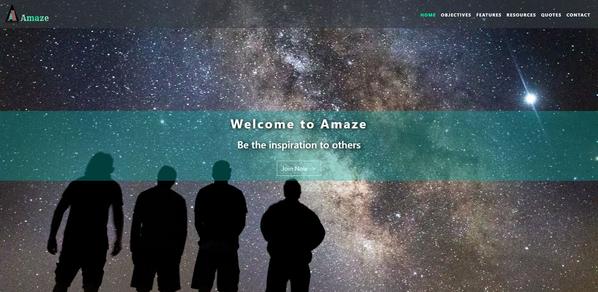

# Amaze

> A website model to spread positivity and bring life back to living

**Using tools -**

- HTML
- CSS
- SCSS
- JavaScript
- Bootstrap


## Features

1. Responsive Web Desiging
2. Compatible for any kind of display size
3. User Friendly
4. Interactive
5. Clean code
6. Wonderful optimization

**HTML SAMPLE**

```HTML
        <div class="col-12 narrow text-center">

            <h1>What is Motivation ?</h1>
            <p>Motivation is the word derived from the word ’motive’ which means needs, desires, wants or drives within
                the individuals. It is the process of stimulating people to actions to accomplish the goals. In the work
                goal context the psychological factors stimulating the people’s behaviour can be -
            <ul>
                <li>Desire for money</li>
                <li>Success</li>
                <li>Recognition</li>
                <li>Job-satisfaction</li>
                <li>Team work, etc</li>
            </ul>
            <strong>The process of motivation consists of three stages -</strong> <br><br>
            <ul>
                <li>A felt need or drive</li>
                <li>A stimulus in which needs have to be aroused</li>
                <li>When needs are satisfied, the satisfaction or accomplishment of goals.</li>
            </ul>

            Therefore, we can say that motivation is a psychological phenomenon which means needs and wants of the
            individuals have to be tackled by framing an incentive plan.
            </p>

        </div>
```

**CSS SAMPLE**

```CSS
.caption h1 {
  font: 3.8rem;
  font-weight: 700;
  letter-spacing: 0.3rem;
  text-shadow: 0.1rem 0.1rem 0.8rem black;
  padding-bottom: 1rem;
}

.caption h3 {
  font-size: 2rem;
  text-shadow: 0.5rem 0.1rem 0.8rem black;
  padding-bottom: 1.6rem;
}

.btn-lg {
  border-width: medium;
  border-radius: 0 !important;
  padding: 36rem 1.3rem;
  font-size: 1.1rem;
  font-weight: 700;
}

/*objectives section*/
.narrow {
  width: 75%;
  margin: 1.5rem auto;
  padding-top: 2rem;
}

.narrow h1 {
  font-size: 3rem;
  padding-top: 3rem;
  margin: 3rem;
}

.narrow ul li {
  list-style-type: none;
}

/*features section*/
.jumbotron {
  margin-bottom: 0;
  padding: 2rem 0 3.5rem;
  border-radius: 0;
}

h3.heading {
  font-size: 1.9rem;
  font-weight: 700;
  text-transform: uppercase;
  margin-bottom: 1.9rem;
}

.heading-underline {
  width: 5rem;
  height: 0.2rem;
  background-color: #00faa0;
  margin: 0 auto 2rem;
}

.features h3 {
  font-size: 1.3rem;
  text-transform: uppercase;
  padding-bottom: 0.4rem;
}

.features p {
  font-size: 1.1rem;
}

```

> Sample Landing Page



### _View this Website in Live -_

https://njmsaikat.github.io/amaze/

> Contact With Developer:


### Saikat Roy

> Email: njmsaikat@gmail.com

> Personal Portfolio: https://njmsaikat.github.io/saikat/

> Linked In Profile: https://www.linkedin.com/in/njmsaikat/

